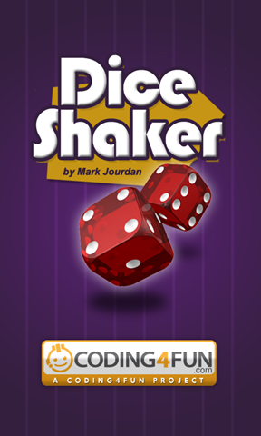
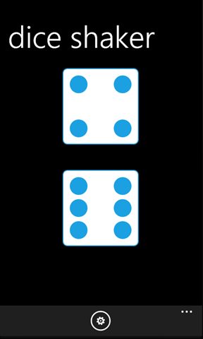
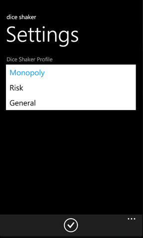
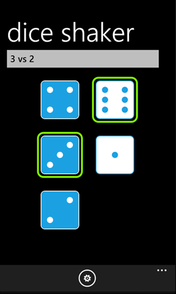

# Project Description

This is the base project for the Coding4Fun Windows Phone 7 Dice Shaker application!  Throw dice three ways using Dice Shaker! Use this app to play Risk or Monopoly, or just roll up to nine six-sided dice.  To simulate a roll, simply shake your phone or flick the screen!

If you want to know how the application works, head over to the Coding4Fun article: 

# Credits

Mark Jourdan for primary development

# Pictures

